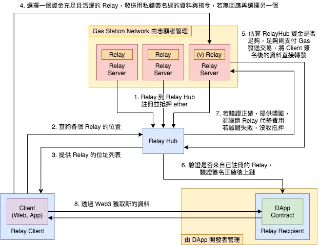

# 架構圖
  

這個 project 是參考別人的 gsn 部署合約和 server
https://github.com/opengsn/gsn  

## 別人寫的 demo 網址  
https://ctf-react.opengsn.org/  

# 流程
1. 用戶發送簽名給 server  
範例簽名  
```
RelayRequest

To:
0x198...672f
Data:
0x239e26f2
From:
Account 1
Value:
0
Nonce:
1
Gas:
500000
ValidUntilTime:
1676977369
RelayData:
RelayWorker:
0x7b5...Ca96
TransactionCalldataGasUsed:
0x1b20
PaymasterData:
0x
MaxFeePerGas:
3006720029
MaxPriorityFeePerGas:
3006720029
Paymaster:
0x086...E4d8
ClientId:
1
Forwarder:
0xB2b...4A87
```

2. Server 呼叫 relayHub 的 `relayCall` function  
範例:  
```
Function: relayCall(string domainSeparatorName,uint256 maxAcceptanceBudget,tuple relayRequest,bytes signature,bytes approvalData)

MethodID: 0x6ca862e2
[0]:  00000000000000000000000000000000000000000000000000000000000000a0
[1]:  0000000000000000000000000000000000000000000000000000000000045a44
[2]:  00000000000000000000000000000000000000000000000000000000000000e0
[3]:  0000000000000000000000000000000000000000000000000000000000000360
[4]:  00000000000000000000000000000000000000000000000000000000000003e0
[5]:  0000000000000000000000000000000000000000000000000000000000000017
[6]:  47534e2052656c61796564205472616e73616374696f6e000000000000000000
[7]:  0000000000000000000000000000000000000000000000000000000000000040
[8]:  0000000000000000000000000000000000000000000000000000000000000160
[9]:  000000000000000000000000d073fa1e4626f900412c152e55d18df65d2ad3a0
[10]: 0000000000000000000000001980a588fa420e874fc5fb1e0e68fbe39c34672f
[11]: 0000000000000000000000000000000000000000000000000000000000000000
[12]: 000000000000000000000000000000000000000000000000000000000007a120
[13]: 0000000000000000000000000000000000000000000000000000000000000001
[14]: 00000000000000000000000000000000000000000000000000000000000000e0
[15]: 0000000000000000000000000000000000000000000000000000000063f4a4d9
[16]: 0000000000000000000000000000000000000000000000000000000000000004
[17]: 239e26f200000000000000000000000000000000000000000000000000000000
[18]: 00000000000000000000000000000000000000000000000000000000b336e81d
[19]: 00000000000000000000000000000000000000000000000000000000b336e81d
[20]: 0000000000000000000000000000000000000000000000000000000000001b20
[21]: 0000000000000000000000007b556ef275185122257090bd59f74fe4c3c3ca96
[22]: 000000000000000000000000086c11bd5a61ac480b326916656a33c474d1e4d8
[23]: 000000000000000000000000b2b5841dbef766d4b521221732f9b618fcf34a87
[24]: 0000000000000000000000000000000000000000000000000000000000000100
[25]: 0000000000000000000000000000000000000000000000000000000000000001
[26]: 0000000000000000000000000000000000000000000000000000000000000000
[27]: 0000000000000000000000000000000000000000000000000000000000000041
[28]: 647f3af2dbd2a4ec49eb1a20c295500b9f4b7737c79020e1d39225c019161e2e
[29]: 247c0013e98e349286696cb12f9c3254ab0d9ad5922596841700e702f9443a60
[30]: 1c00000000000000000000000000000000000000000000000000000000000000
[31]: 0000000000000000000000000000000000000000000000000000000000000000
```

範例網址:  
https://mumbai.polygonscan.com/tx/0xe2e1cfc120bf32869da25eb03375360ac7e711e020599ef88d6c9b45be212fdf


Relays a transaction. For this to succeed, multiple conditions must be met:

Paymaster's preRelayCall method must succeed and not revert.
the msg.sender must be a registered Relay Worker that the user signed to use.
the transaction's gas fees must be equal or larger than the ones that were signed by the sender.
the transaction must have enough gas to run all internal transactions if they use all gas available to them.
the Paymaster must have enough balance to pay the Relay Worker if all gas is spent.
If all conditions are met, the call will be relayed and the Paymaster charged.

domainSeparatorName: The name of the Domain Separator used to verify the EIP-712 signature

maxAcceptanceBudget: The maximum valid value for paymaster.getGasLimits().acceptanceBudget to return.

relayRequest: All details of the requested relayed call.

signature: The client's EIP-712 signature over the relayRequest struct.

approvalData: The dapp-specific data forwarded to the Paymaster's preRelayedCall method. This value is not verified by the RelayHub in any way. As an example, it can be used to pass some kind of a third-party signature to the Paymaster for verification.

Emits a TransactionRelayed event regardless of whether the transaction succeeded or failed.

